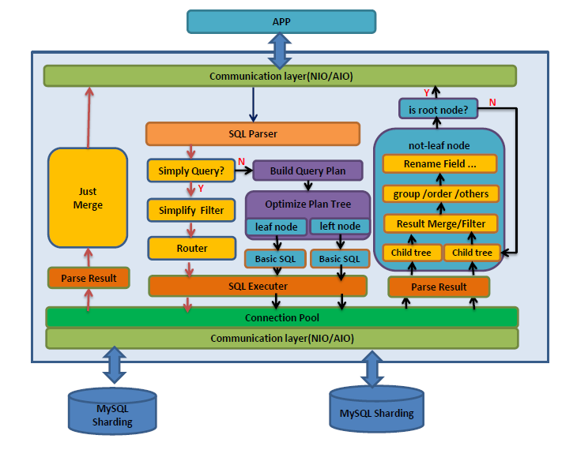

# dble

dble (pronouced "double", less bug and no "ou") is maintain by [ActionTech](http://www.actionsky.com/).

## What is dble?

dble is a high scalability middle-ware for MySQL sharding. 

- __Sharding__
As your business grows, you can use dble to replace the origin single MySQL instance. 

- __Compatible with MySQL protocol__
Use dble as same as MySQL. You can replace MySQL with dble to power your application without changing a single line of code in most cases.

- __High availability__
dble server can used as clustered, business will not suffer with single node fail.

- __SQL Support__
Support(some in Roadmap) SQL 92 standard and MySQL dialect. We support complex SQL query like group by, order by, distinct, join ,union, sub-query(in Roadmap) and so on.

- __Complex Query Optimization__
Optimize the complex query, including, without limitation, Global-table join sharding-table, ER-relation tables, Sub-Queries, Simplifying select items, and the like.

- __Distributed Transaction__
Support Distributed Transaction using two-phase commit. You can choose normal mode for performance or XA mode for data safe, of course, the XA mode dependent on MySQL-5.7's XA Transaction, MySQL node's high availability and data reliability of disk.

## History
dble is based on [MyCat](https://github.com/MyCATApache/Mycat-Server). First we should thanks to MyCat's contributors.

For us, focus on MySQL is a better choice. So we cancelled the support for other databases, deeply improved/optimized its behavior on compatibility, complex query and distributed transaction. And of course, fixed lots of bugs.

For more details, see [Roadmap](./docs/ROADMAP.md) and [Issues](https://github.com/actiontech/dble/issues) . 

## Roadmap

Read the [Roadmap](./docs/ROADMAP.md).

## Architecture

## Quick start 
Read the [Quick Start](./docs/QUICKSTART.md).

## Contributing

Contributions are welcomed and greatly appreciated. See [CONTRIBUTING.md](./docs/CONTRIBUTING.md)
for details on submitting patches and the contribution workflow.

## Community

* IRC: 
* QQ group: 669663113
