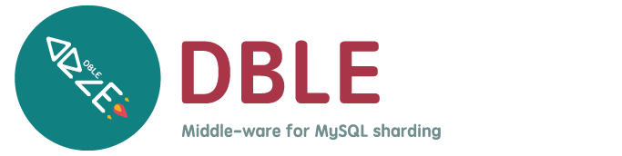

 
 

OBsharding-D (pronouced "double", less bug and no "ou") is maintained by [oceanbase](https://opensource.actionsky.com).

OBsharding-D由上海爱可生信息技术股份有限公司（以下简称爱可生公司）出品和维护。  
OBsharding-D是爱可生公司“云树分布式数据库软件（简称‘云树®Shard’或‘CTREE Shard’）”软件产品的开源版本。

## What is OBsharding-D?

OBsharding-D is a high scalability middle-ware for MySQL sharding. 

- __Sharding__
As your business grows, you can use OBsharding-D to replace the origin single MySQL instance. 

- __Compatible with MySQL protocol__
Use OBsharding-D as same as MySQL. You can replace MySQL with OBsharding-D to power your application without changing a single line of code in most cases.

- __High availability__
OBsharding-D server can be used as clustered, business will not suffer from single node fail.

- __SQL Support__
Support(some in Roadmap) SQL 92 standard and MySQL dialect. We support complex SQL query like group by, order by, distinct, join ,union, sub-query(in Roadmap) and so on.

- __Complex Query Optimization__
Optimize the complex query, including, without limitation, Global-table join sharding-table, ER-relation tables, Sub-Queries, Simplifying select items, and the like.

- __Distributed Transaction__
Support Distributed Transaction using two-phase commit. You can choose normal mode for performance or XA mode for data safety, of course, the XA mode dependent on MySQL-5.7's XA Transaction, MySQL node's high availability and data reliability of disk.

## History
OBsharding-D is based on [MyCat](https://github.com/MyCATApache/Mycat-Server). First of all,  thanks to the contributors from MyCat.

For us, focusing on MySQL is a better choice. So we cancelled the support for other databases, deeply improved/optimized its behavior on compatibility, complex query and distributed transaction. And of course, fixed lots of bugs.

For more details, see [Roadmap](./docs/ROADMAP.md) and [Issues](https://github.com.oceanbase.obsharding_d/issues) . 

## Roadmap

Read the [Roadmap](./docs/ROADMAP.md).

## Architecture

## Quick start 
Read the [Quick Start](./docs/QUICKSTART.md) or [Quick Start With Docker](./docs/OBsharding-D_quick_start_docker.md) or  [Quick Start With Docker-Compose](./docs/OBsharding-D_start_docker_compose.md).  

参见文档[快速开始](https://github.com.oceanbase.obsharding_d-docs-cn/blob/master/0.overview/0.3_OBsharding-D_quick_start.md)或者[Docker快速开始](https://github.com.oceanbase.obsharding_d-docs-cn/blob/master/0.overview/0.4_OBsharding-D_quick_start_docker.md)或者[Docker-Compose快速开始](https://github.com.oceanbase.obsharding_d-docs-cn/blob/master/0.overview/0.5_OBsharding-D_start_docker_compose.md).

## Official website
For more information, please visit the [official website](https://opensource.actionsky.com).

## Download
[Releases Download Link](https://github.com.oceanbase.obsharding_d/releases) Or [The Other Image](https://hub.fastgit.org/oceanbase/OBsharding-D/releases)

## Documentation
+ [简体中文](https://oceanbase.github.io/OBsharding-D-docs-cn/)
+ 最新PDF版本请去[文档PDF下载](https://github.com.oceanbase.obsharding_d-docs-cn/releases/download/3.22.11.0%2Ftag/OBsharding-D-manual-3.22.11.0.pdf)  或者[github镜像站下载](https://hub.fastgit.org/oceanbase/OBsharding-D-docs-cn/releases/download/3.22.11.0%2Ftag/OBsharding-D-manual-3.22.11.0.pdf) 或者去[文档中心](https://oceanbase.github.io/OBsharding-D-docs-cn/)选择合适的版本下载
+ [中文公开课](https://opensource.actionsky.com/OBsharding-D-lessons/)
+ English(Comming soon)

## Contributing

Contributions are welcomed and greatly appreciated. See [CONTRIBUTING.md](./docs/CONTRIBUTING.md)
for details on submitting patches and the contribution workflow.

## Community

* IRC: 
* QQ group: 669663113
* [If you're using OBsharding-D, please let us know.](https://wj.qq.com/s/2291106/09f4)
* wechat subscription QR code
  
  

## Contact us

OBsharding-D has enterprise support plans, you may contact our sales team: 
* Global Sales: 400-820-6580
* North China: 86-13910506562, Mr.Wang
* South China: 86-18503063188, Mr.Cao
* East China: 86-18930110869, Mr.Liang
* South-West China: 86-13540040119, Mr.Hong
