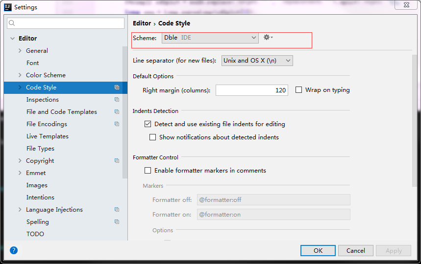
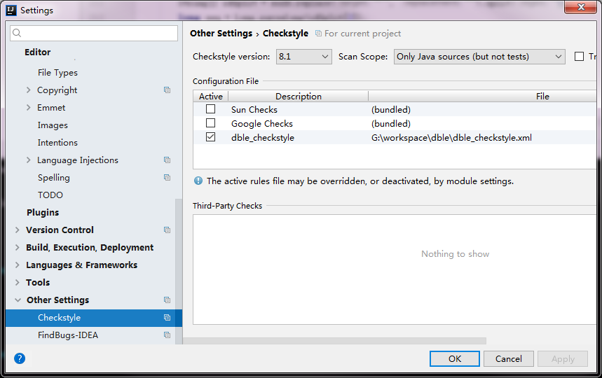
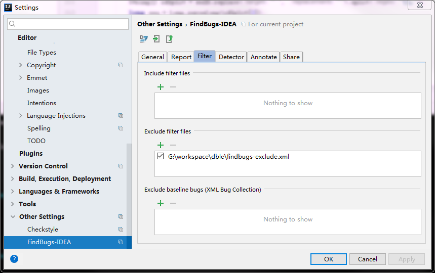
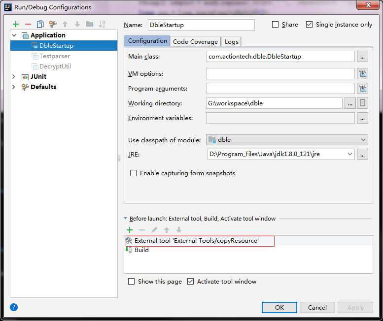
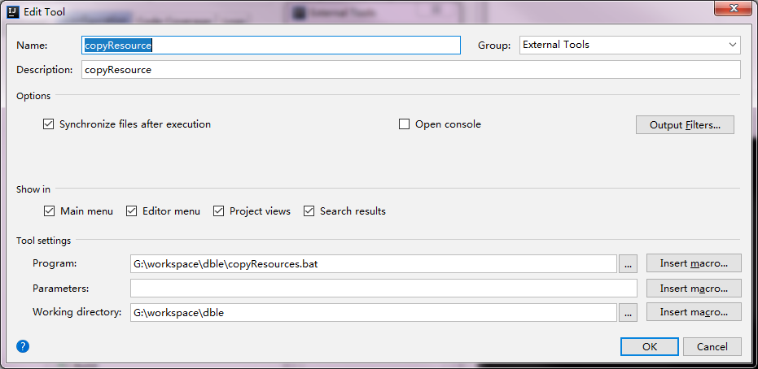

VCS: git  
Dependency Management:maven  
IDE:IntelliJ IDEA  Community  

setting IDE code style:    
import dble_IntelliJ.xml into IntelliJ

 
 

Checkstyle Plugin: check before commit  

setting:  

FindBugs-IDEA:check before commit  

setting:  
  

copy config files to target before build( FOR windows )  

  

 